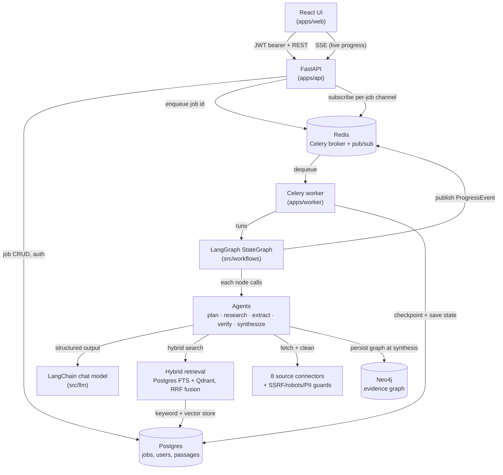

# Evidence Research Agent

An autonomous research system that takes a question, searches across eight
source types, extracts **structured evidence**, builds an **evidence graph**,
detects contradictions between sources, verifies every claim, and produces a
**citation-backed report** — with live progress streamed to a React UI while
it runs.

> **Core principle:** generated text is never evidence. Every claim in the
> final report traces to a specific passage from a specific source, and its
> confidence score is computed from measurable signals — never an LLM's
> self-rating of its own output.

The system is built as a graph of small, single-responsibility components
that communicate through a few explicit channels: a LangGraph state machine
for orchestration, Postgres/Redis for durable job state, Neo4j for the
evidence graph, and Server-Sent Events for live progress. The sections below
walk through each component and how it talks to its neighbors.

## Architecture at a glance



Two things about this shape are deliberate:

- **The API never runs the pipeline.** It only writes a job row and enqueues
  its id; a Celery worker is the only thing that executes the LangGraph
  graph. This keeps the request path fast and lets the pipeline run for
  minutes without holding an HTTP connection open.
- **Progress is a side channel, not a return value.** The graph publishes
  `ProgressEvent`s as it runs; the worker writes them to Postgres and Redis
  pub/sub; the API replays them as SSE. A client that connects mid-run, or
  after the job has already finished, always gets a consistent snapshot
  first — it never blocks.

## Orchestration: a LangGraph `StateGraph`

`src/workflows/research.py` compiles a `StateGraph` over a single
`ResearchState` object — six nodes, one conditional edge:

```
START → plan → search ─┬─(has passages)─→ extract → score → verify → synthesize → END
                        └─(no passages)───────────────────────────────→ synthesize
```

Each node (`src/workflows/nodes.py`) is a thin wrapper: open a tracing span,
call the corresponding agent, bill token usage, return only the state fields
that changed. `run_pipeline` drives the graph with
`compiled_graph.stream(..., stream_mode=["updates", "custom"])`: `updates`
payloads become `STAGE_COMPLETED` events, and `custom` payloads are
`ProgressEvent`s the nodes emit directly via LangGraph's `get_stream_writer()`
(`src/workflows/progress_emitter.py`). Neither the agents nor the emitter
know anything about Redis or SSE — they just call a plain Python callback or
a no-op stream writer, which keeps the domain logic transport-agnostic.

The graph is compiled with a checkpointer, so a crashed worker resumes from
the last completed node instead of restarting the whole job. In production
that's LangGraph's `PostgresSaver`, keyed by a thread id scoped to
`user:session:research_id` (`src/workflows/checkpoint.py`) so one user's
resumable state can never collide with another's.

## Agents

Five agents, each a small function over `ResearchState`, chained by the
graph:

| Agent | File | Job |
|---|---|---|
| **Planner** | `src/agents/planner.py` | Decomposes the question into a capped number of differentiating sub-questions (depth-tier dependent), never trivial restatements. |
| **Researcher** | `src/agents/researcher.py` | Runs every sub-question through the configured source connectors, fetches + sanitizes content, dedupes by content hash, chunks into passages, and registers them with the retrieval index. |
| **Extractor** | `src/agents/extractor.py` | Turns retrieved passages into structured claims. Every claim must cite a passage id and quote a verbatim snippet — a hallucinated passage id is dropped, not trusted. |
| **Verifier** | `src/agents/verifier.py` | Runs three sub-stages in sequence: resolve paraphrased claims into one canonical claim, adjudicate contradictions between sources, then assign each claim a final status. |
| **Synthesizer** | `src/agents/synthesizer.py` | Renders the report directly from verified claims with citation markers and confidence bars. The LLM only writes the executive summary, and only from the already-verified claim list — it cannot introduce new facts into the report body. |

Every agent that needs the LLM builds a chain with
`build_structured_chain(llm, prompt, schema)` (`src/llm/chains.py`) —
`prompt | chat_model.with_structured_output(schema, include_raw=True) |
.with_retry(...)`. Prompts are `ChatPromptTemplate`s centralized in
`src/prompts.py`; any retrieved or model-generated text that gets fed back
into a prompt is wrapped with `wrap_untrusted()`
(`src/security/injection.py`) so it's structurally impossible to confuse
untrusted data with system instructions.

## Retrieval: hybrid search without a vector-only shortcut

`src/retrieval/` runs two independent ranking arms per query and fuses them
with **Reciprocal Rank Fusion** (`src/retrieval/hybrid.py`) — `score(passage)
= Σ 1 / (60 + rank)` across each arm's ranked list, so the two arms don't need
calibrated, comparable scores to combine:

- **Keyword arm** — Postgres full-text search (`tsvector` / `ts_rank`).
- **Semantic arm** — an embedding of the query against passage vectors in
  Qdrant.

`PassageIndex` (`src/retrieval/index.py`) is a hand-rolled interface, not
LangChain's `EnsembleRetriever` — deliberately. It's the single writer of the
`passages` table (so nothing else can create a second source of truth for
passage storage) and its keyword arm is Postgres FTS, not an in-memory
BM25 index, which `EnsembleRetriever` doesn't model. A production
implementation (`PostgresQdrantPassageIndex`) and a pure-Python in-memory
implementation (`InMemoryPassageIndex`) both satisfy the same protocol, which
is what lets the entire pipeline run in tests with no database.

## Evidence graph & claim reasoning

This is the part that distinguishes the system from a search-and-summarize
pipeline: every claim's trustworthiness is computed, never asserted by a
model.

**Confidence** (`src/evidence/confidence.py`) is a product of four
independently measurable signals:

```
confidence = source_quality × evidence_strength × source_agreement × extraction_confidence
```

- `source_quality` — a weighted blend of authority (by source type),
  recency, relevance, primary-source bonus, and corroboration
  (`src/sources/quality.py`).
- `evidence_strength` — cosine similarity between the claim's embedding and
  its supporting passage's embedding.
- `source_agreement` — how many *distinct* sources corroborate the claim,
  capped and normalized.
- `extraction_confidence` — a calibrated extraction signal, kept separate
  from the model's own certainty.

**Contradiction detection** (`src/evidence/resolution.py` +
`src/evidence/contradiction.py`) runs before verification: claims are
compared pairwise by embedding similarity; above a threshold, an LLM
reconciliation call classifies the pair as the *same* claim (merge evidence
into one canonical claim), a *contradiction* (kept separate, flagged as a
candidate), or genuinely *different*. Each contradiction candidate is then
adjudicated by measurable source-quality signals to pick a "winner" —
never silently; both sides are always surfaced in the final report.

**Verification** (`src/evidence/verification.py`) assigns each claim a final
status — `VERIFIED`, `PARTIALLY_SUPPORTED`, `CONFLICTING`, or `UNSUPPORTED`
— by combining an LLM entailment check (does the cited snippet actually
support the claim?) with the claim's computed confidence and its membership
in a detected contradiction.

The graph itself (`src/evidence/graph.py`) is a plain projection of
`ResearchState` into nodes (`Source`, `Entity`, `Claim`) and typed edges
(`SUPPORTS`, `ABOUT`, `CONTRADICTS`); the same projection both backs the
`GET /graph` endpoint the UI's Evidence Explorer reads, and is written into
Neo4j (`src/stores/graph.py`) once synthesis completes — so the graph shape
has exactly one definition, not two that can drift apart.

## Sources & security

Seven connectors (`src/sources/`) — Tavily (serving both web search and
documentation pages), arXiv, Semantic Scholar, GitHub, Reddit, YouTube, and a
generic API connector — cover eight `SourceType`s, all behind one
`SourceConnector` protocol (`src/sources/base.py`), so the researcher agent
never branches on source type. `registry.py` builds only the connectors a
request needs and skips any whose API key is missing, rather than failing the
whole run.

Because everything the pipeline reads comes from the open internet, fetching
is hardened end to end (`src/security/`):

- **SSRF guard** (`url_guard.py`) — resolves the hostname and rejects
  private/link-local/reserved IP ranges, re-checked on **every redirect
  hop** so a public URL that 302s to an internal address can't slip through.
- **robots.txt compliance** (`robots.py`) — checked before every fetch,
  parsers cached per origin.
- **Resource limits** (`limits.py`) — page size, document size, source
  count, and crawl recursion all have hard ceilings independent of the
  per-depth-tier caps.
- **PII redaction** (`pii.py`) — obvious emails/phone numbers are redacted
  from fetched text before it's stored or ever reaches a prompt.
- **Prompt-injection isolation** (`injection.py`) — retrieved text is
  wrapped in explicit `BEGIN/END UNTRUSTED` delimiters and passed as a
  template *value*, never interpolated into a prompt string, so a page that
  says "ignore previous instructions" is just data the model is told to
  quote, not obey.

## LLM & embeddings: native LangChain, no custom seams

`src/llm/factory.py` builds a chat model with LangChain's `init_chat_model`
against whichever provider is configured (OpenAI, Anthropic, Vertex, or a
self-hosted OpenAI-compatible endpoint) and wraps it in `StructuredLLM`
(`src/llm/base.py`) — a logic-free bundle of the chat model plus the
`with_structured_output` method appropriate for that provider (function
calling vs. JSON mode, since self-hosted models often lack reliable tool
calling) and a retry count. `build_structured_chain` (`src/llm/chains.py`)
is the one place every agent goes through to get `{"parsed": <schema>,
"raw": <message>}` back, so token accounting (`src/llm/usage.py`) is read
from the same place for every call regardless of provider.

Rate limiting, retries, and caching all reuse LangChain's own primitives
instead of hand-rolled versions: an `InMemoryRateLimiter` attaches to the
chat model when a request rate is configured; `.with_retry()` wraps the
structured chain; `set_llm_cache()` (`src/llm/caching.py`) is configured
once at process startup with an in-memory or Redis-backed cache depending on
settings.

## Persistence & real-time

- **Postgres** (SQLAlchemy + Alembic, `src/db/`) is the system of record for
  jobs, users, and passages (including the `tsvector` column the keyword
  retrieval arm queries directly).
- **Qdrant** (`src/stores/vector.py`) holds passage embeddings, scoped by
  job id.
- **Neo4j** (`src/stores/graph.py`) holds the evidence graph, written once
  per job at synthesis time.
- **Redis** is dual-purpose: the Celery broker/result backend, and the
  pub/sub transport for live progress (`src/realtime/`), on a channel named
  per job so subscribers only ever see their own job's events.

## API & auth

FastAPI (`apps/api/`) is JWT-authenticated end to end: every data route
depends on `require_user`, which verifies an HS256 token carrying the user
id (`sub`) and a per-login session id (`sid`), and fails closed if no
signing secret is configured. The only unauthenticated routes are
`POST /auth/token` and `POST /auth/signup`. Jobs are owned
(`owner_user_id`/`owner_session_id`), and `require_owned_job` enforces
access — a 404 for a job that doesn't exist, a 403 for one that isn't yours,
so existence isn't leaked to the wrong caller.

`GET /api/research/{id}/events` (`apps/api/events.py`) is the SSE endpoint:
it always yields a `SNAPSHOT` of the persisted state first — so a client
reconnecting mid-run, or opening the link after the job already finished,
is never left waiting — then either closes immediately (if the snapshot is
already terminal) or subscribes to the job's Redis channel and forwards
events until a `DONE`/`ERROR` arrives.

## Worker

The Celery worker (`apps/worker/celery_app.py`) is the only thing that
actually executes the graph: it loads the queued job from Postgres, opens a
`PostgresSaver` checkpointer scoped to that job's thread id, builds live
dependencies (LLM, embeddings, connectors, passage index, graph store), and
runs `run_pipeline`. A progress sink (`apps/worker/progress.py`) is threaded
through as `on_progress_event`: every event first updates the job's cheap
status columns in Postgres, then publishes on Redis so any open SSE
connection sees it live. On any exception the job is marked `FAILED` with
the error recorded, and a terminal event is guaranteed to reach subscribers
even after a hard crash.

## Frontend

A React + TypeScript app (`apps/web/`, Vite) with route-level code split
between an unauthenticated shell (login/signup) and an authenticated one
(`AppShell` + session sidebar). `AuthContext` holds the JWT and drives
`RequireAuth`; `useResearchStream` opens the SSE connection for a running
job (via a dependency-free SSE line parser in `lib/sse.ts`, decoupled from
`fetch` so it's unit-testable), reduces incoming events into UI state with
capped exponential-backoff reconnection, and hands off to
`useResearchResults` once the job reaches a terminal status. The **Evidence
Explorer** renders the graph payload from `GET /graph`: clicking a claim
shows its confidence breakdown, supporting sources, and any contradicting or
related claims, with click-through navigation between them.

## Evaluation

`src/evaluation/` is a benchmark harness, not an afterthought: a typed
dataset schema, a dependency-injected runner that executes the real pipeline
against fakes or live providers, and metrics across three axes — retrieval
(Recall@k, MRR, nDCG), citation (correctness/completeness), and generation
(topic completeness, groundedness, claim coverage). `src/evaluation/gate.py`
compares mean metrics against minimum thresholds and fails CI
(`.github/workflows/ci.yml`) on regression — the same gate that runs on fakes
in CI can run against live providers in a scheduled job.

## Tech stack

| Layer | Choice |
|---|---|
| API | FastAPI + Pydantic v2, JWT auth |
| Orchestration | LangGraph `StateGraph` with a Postgres checkpointer |
| Queue / worker | Redis + Celery |
| Jobs, users, passages | PostgreSQL (SQLAlchemy + Alembic) |
| Vector search | Qdrant |
| Evidence graph | Neo4j |
| Live progress | Redis pub/sub → Server-Sent Events |
| LLM | LangChain `init_chat_model` — OpenAI / Anthropic / Vertex / self-hosted |
| Embeddings | LangChain `Embeddings` — OpenAI / Voyage |
| Search sources | Tavily, arXiv, Semantic Scholar, GitHub, Reddit, YouTube, generic API |
| Frontend | React + TypeScript (Vite), SSE client, React Router |
| Observability | OpenTelemetry stage tracing, optional Langfuse callback |
| Testing | `pytest`, dependency-injected fakes for every external service |

## Quick start

```bash
# 1. Dependencies (uv)
uv venv && uv pip install -e ".[dev]"

# 2. Config
cp .env.example .env        # set LLM_PROVIDER + a key, and TAVILY_API_KEY

# 3. Infra (Postgres, Neo4j, Qdrant, Redis)
docker compose up -d

# 4. Run the API and worker
uv run uvicorn apps.api.main:app --reload
celery -A apps.worker.celery_app worker --loglevel=info

# 5. Create a user, then start a research job
uv run python -m scripts.create_user
curl -X POST localhost:8000/api/research \
  -H 'authorization: Bearer <token>' -H 'content-type: application/json' \
  -d '{"question":"Compare Qwen, Llama and Mistral for customer support","depth":"fast"}'
```

Poll `GET /api/research/{id}`, or open `GET /api/research/{id}/events` for
live progress, then read `GET /api/research/{id}/report`.

## Tests

```bash
uv run pytest          # unit + integration, no external services required
```

Every external dependency — the LLM, embeddings, connectors, Postgres,
Qdrant, Neo4j, Redis — is injected behind an interface with an in-memory or
fake implementation, so the full pipeline is exercised in CI without any
running infrastructure.
