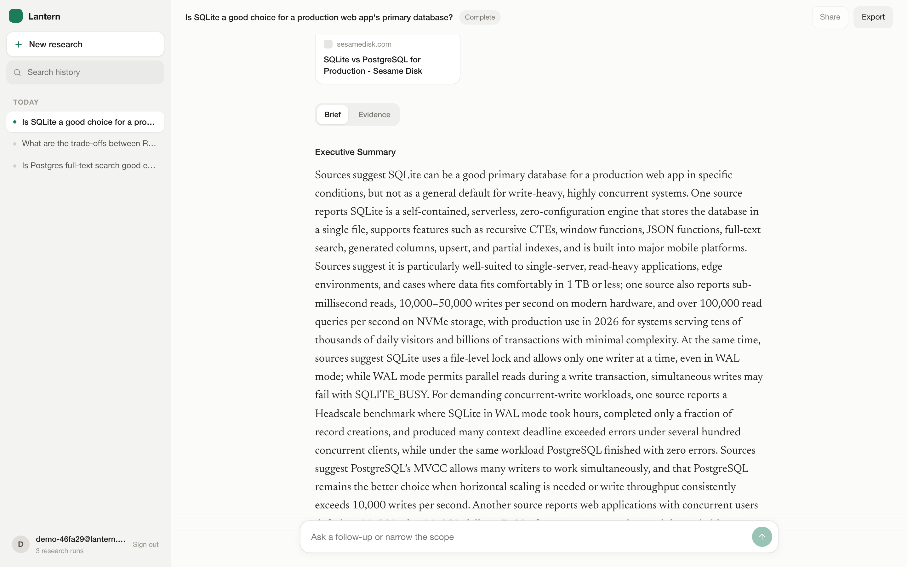
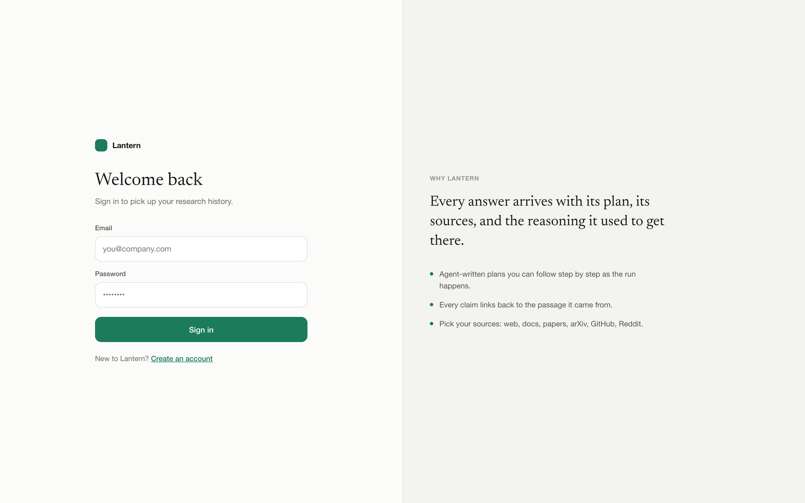
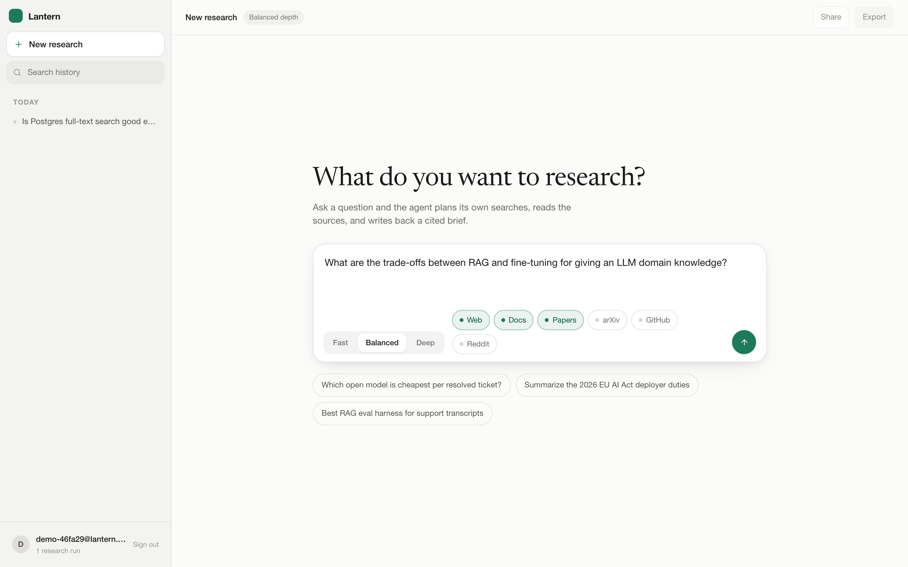
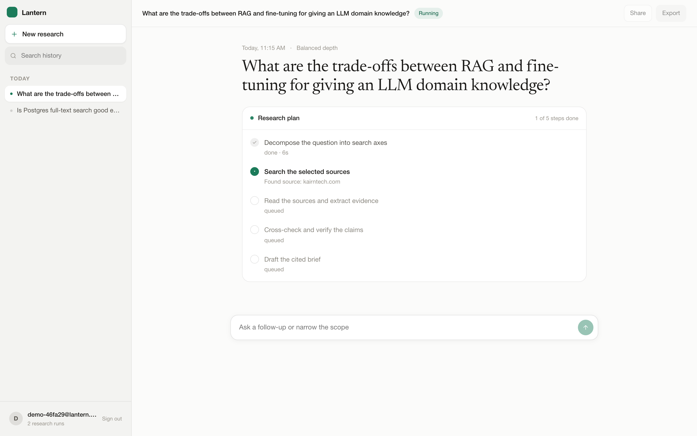
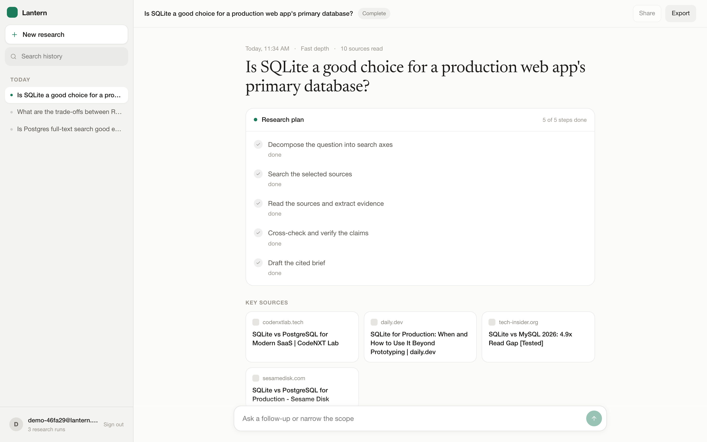
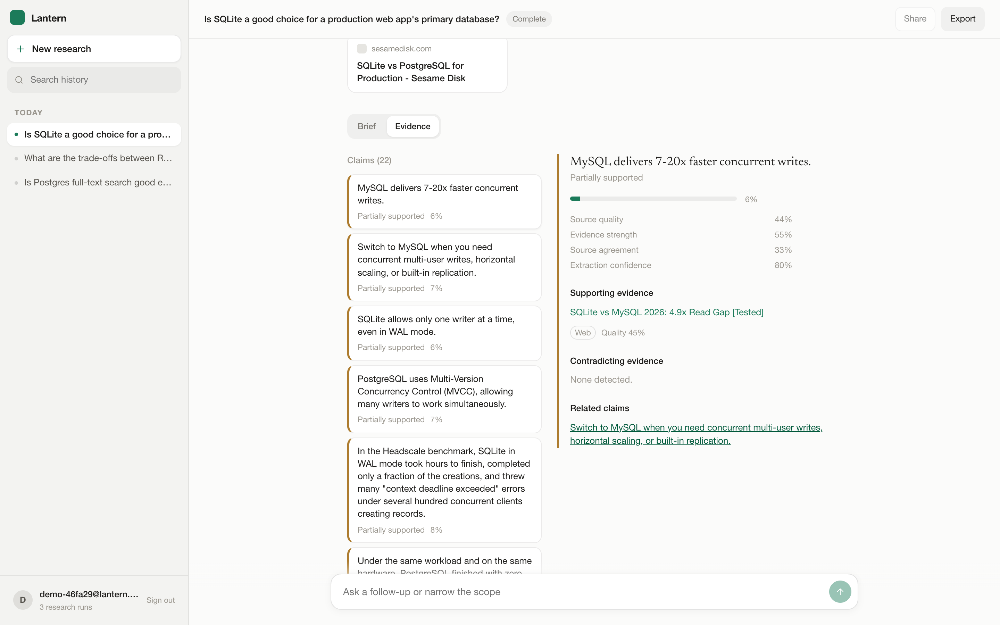
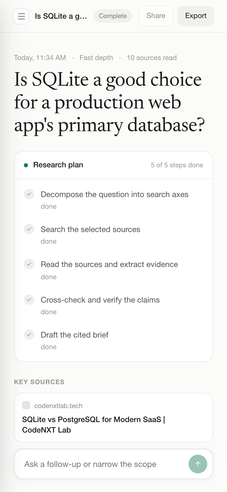
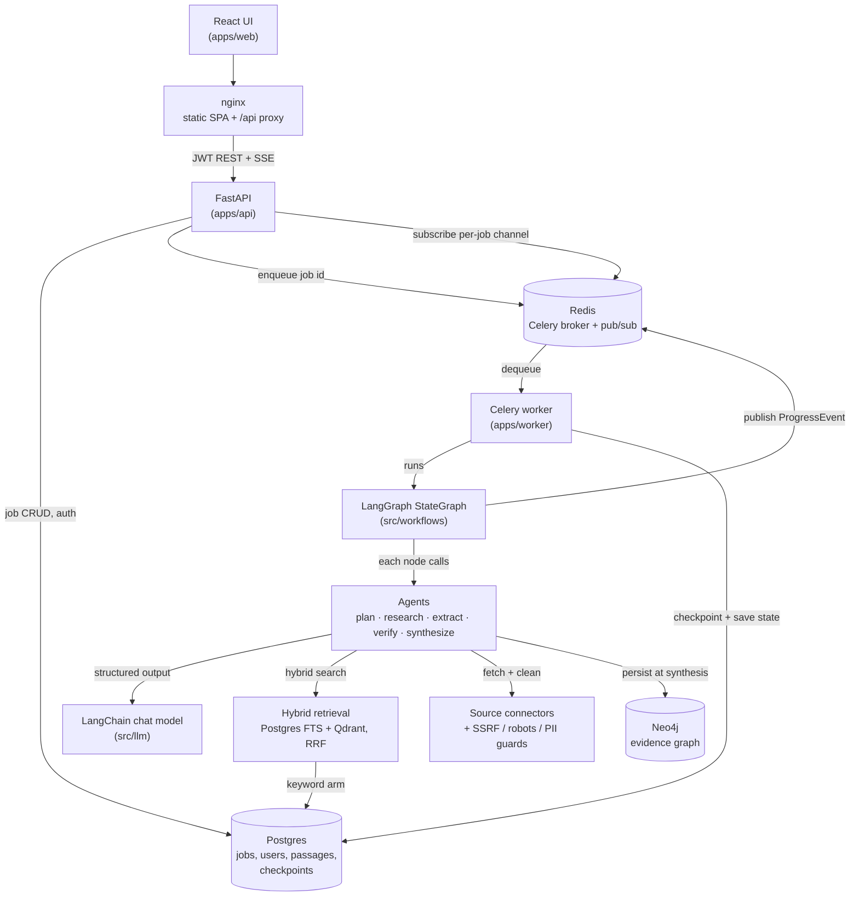

# Evidence Research Agent

[](https://github.com/zaineb-damak/evidence-research-agent/actions/workflows/ci.yml)
[](https://github.com/zaineb-damak/evidence-research-agent/actions/workflows/security.yml)

An autonomous research agent that answers a question with a **citation-backed
brief**. It plans its own searches, reads the sources, extracts claims, cross-checks
them against each other, scores how well each one is supported, and streams
every step to the browser while it works.

> **Core principle: generated text is never evidence.** Every claim in a report
> traces to a passage from a specific source, quoted verbatim. Its confidence is
> computed from measurable signals, never from the model rating its own output.
> The summary is the only free-form text the LLM writes, it may use only claims
> that have already been checked, and it has to word each one according to its
> verification status.

<p align="center">
  
</p>

---

## Contents

- [What it looks like](#what-it-looks-like)
- [What happens during a run](#what-happens-during-a-run)
- [Architecture](#architecture)
- [Design decisions](#design-decisions)
- [How it is verified](#how-it-is-verified)
- [Known limitations](#known-limitations)
- [Running it](#running-it)
- [API](#api)
- [Deployment](#deployment)
- [Repository layout](#repository-layout)
- [Tech stack](#tech-stack)

---

## What it looks like

All screenshots come from real runs against live providers (OpenAI, Tavily) on
the local Docker Compose stack. None are mock-ups.

| | |
|---|---|
| **Sign in.** JWT auth; every data route is owned by a user. | **Ask.** Choose a depth tier and the source types to search. |
|  |  |
| **Watch it work.** The plan updates live over Server-Sent Events as each stage starts, reports progress and finishes. | **Read the brief.** The plan, the key sources it read, and the cited report. |
|  |  |
| **Inspect the evidence.** Each claim has its confidence broken into four signals, its supporting source, and any contradicting or related claims. | **Mobile.** Below 768px the sidebar becomes a drawer. |
|  |  |

---

## What happens during a run

A run is a LangGraph `StateGraph` with six nodes and one conditional edge:

```
START → plan → search ─┬─(found passages)─→ extract → score → verify → synthesize → END
                        └─(nothing found)──────────────────────────────→ synthesize
```

Here is what each stage did in a real `fast`-depth run (*"Is SQLite a good
choice for a production web app's primary database?"*, October 2026):

| Stage | What it does | Observed |
|---|---|---|
| **plan** | Breaks the question into sub-questions, each covering a different angle. | 5 sub-questions, ~6 s |
| **search** | Runs each sub-question through the selected connectors; fetches, sanitizes, dedupes and chunks the pages; indexes the chunks for hybrid retrieval. | 10 sources, ~250 passages |
| **extract** | For each sub-question, retrieves the top passages and extracts claims, each one citing a passage id and quoting it verbatim. The claim cap is shared fairly across sub-questions. | 5 claims × 5 sub-questions |
| **score** | Computes each claim's confidence from four measured signals. | — |
| **verify** | Merges paraphrased claims, checks for contradictions between sources, checks that each quote actually supports its claim, and assigns a status. | 25 → 21–25 claims |
| **synthesize** | Builds the report body from the scored claims; the LLM writes only the summary. | ~6 KB report, ~20 citations |

**Whole run: 80–100 s and about $0.10 to $0.11 per `fast` run** (≈18k input
and 3.6k output tokens). The cost is metered per stage and stored on the job.

---

## Architecture


```mermaid
graph TD
    UI["React UI<br/>(apps/web)"]
    NGINX["nginx<br/>static SPA + /api proxy"]
    API["FastAPI<br/>(apps/api)"]
    PG[("Postgres<br/>jobs, users, passages,<br/>checkpoints")]
    REDIS[("Redis<br/>Celery broker + pub/sub")]
    WORKER["Celery worker<br/>(apps/worker)"]
    GRAPH["LangGraph StateGraph<br/>(src/workflows)"]
    AGENTS["Agents<br/>plan · research · extract · verify · synthesize"]
    LLM["LangChain chat model<br/>(src/llm)"]
    RETRIEVAL["Hybrid retrieval<br/>Postgres FTS + Qdrant, RRF"]
    SOURCES["Source connectors<br/>+ SSRF / robots / PII guards"]
    NEO4J[("Neo4j<br/>evidence graph")]

    UI --> NGINX
    NGINX -- "JWT REST + SSE" --> API
    API -- "job CRUD, auth" --> PG
    API -- "enqueue job id" --> REDIS
    API -- "subscribe per-job channel" --> REDIS
    REDIS -- "dequeue" --> WORKER
    WORKER -- "runs" --> GRAPH
    GRAPH -- "each node calls" --> AGENTS
    AGENTS -- "structured output" --> LLM
    AGENTS -- "hybrid search" --> RETRIEVAL
    AGENTS -- "fetch + clean" --> SOURCES
    RETRIEVAL -- "keyword arm" --> PG
    AGENTS -- "persist at synthesis" --> NEO4J
    GRAPH -- "publish ProgressEvent" --> REDIS
    WORKER -- "checkpoint + save state" --> PG
```

Two parts of this shape are deliberate:

- **The API never runs the pipeline.** It writes a job row and enqueues the
  job id. Only the Celery worker executes the graph, so a request returns in
  milliseconds even though a run takes minutes.
- **Progress is a side channel, not a return value.** Nodes emit
  `ProgressEvent`s through LangGraph's `get_stream_writer()`. The worker writes
  each one to Postgres, then publishes it on a per-job Redis channel, and the
  API relays it as SSE. Every stream starts with a `SNAPSHOT` of the persisted
  state, so a client that reconnects mid-run, or opens a run that has already
  finished, never sits waiting.

The graph is compiled with LangGraph's `PostgresSaver`, so a worker that crashes
resumes from the last completed node. Checkpoint threads are scoped
`user:session:research_id`, so one user's resumable state cannot collide with
another's.

---

## Design decisions

### Confidence is computed, never self-reported

```
confidence = source_quality × evidence_strength × source_agreement × extraction_confidence
```

| Signal | Measured as |
|---|---|
| `source_quality` | weighted blend of authority (by source type), recency, relevance, primary-source bonus, corroboration |
| `evidence_strength` | cosine similarity between the claim and its supporting passage |
| `source_agreement` | number of *distinct* sources that corroborate the claim, capped and normalized |
| `extraction_confidence` | a calibrated extraction signal, kept separate from the model's own certainty |

The score is a product on purpose: one weak signal pulls the whole score down.
A claim backed by a single web page therefore scores low even when the quote
matches perfectly, and the Evidence tab shows exactly which signal is
responsible.

### Verification and contradictions

Claims are compared pairwise by embedding similarity. Pairs above a threshold
go to an LLM reconciliation call, which classifies them as **same** (merged
into one canonical claim with the evidence pooled), **contradiction**, or
**different**. Contradictions are settled using source-quality signals, and
both sides always appear in the report. Each claim then receives a status
(`verified`, `partially_supported`, `conflicting` or `unsupported`) from an
entailment check (does the quoted snippet actually support the claim?)
combined with its confidence score and whether it is part of a contradiction.

### The model writes the summary, nothing else

The report body (findings, status labels, confidence bars and sources) is
rendered from data. The LLM writes only the executive summary. It receives
only the checked claims, each tagged with its status, and is told to match its
wording to that status: hedge `partially_supported`, and say so when sources
disagree.

### Hybrid retrieval, with a custom index on purpose

Each query runs two ranking arms, **Postgres full-text search** and **Qdrant**
vectors, and fuses them with Reciprocal Rank Fusion: `Σ 1/(60 + rank)`. RRF
needs no calibration between the two arms' scores. `PassageIndex` is
hand-rolled rather than LangChain's `EnsembleRetriever` for two reasons: it is
the **single writer** of the `passages` table, and its keyword arm is Postgres
FTS rather than an in-memory BM25. An in-memory implementation satisfies the
same protocol, which is what lets the whole pipeline run in tests without a
database.

### Everything fetched is treated as hostile

- **SSRF guard.** Each hostname is resolved and private, link-local or reserved
  ranges are rejected. The check repeats on **every redirect hop**.
- **robots.txt** is checked before every fetch.
- **Hard resource ceilings** cap page size, document size, source count and
  crawl depth.
- **PII redaction** removes email addresses and phone numbers before text is
  stored or reaches a prompt.
- **Prompt-injection isolation.** Retrieved text is wrapped in
  `BEGIN/END UNTRUSTED` delimiters and passed as a template *value*. It is never
  interpolated into a prompt string.

### LangChain-native, no custom LLM layer

Prompts are `ChatPromptTemplate`s kept in one module (`src/prompts.py`).
Structured output goes through a single chain builder,
`prompt | model.with_structured_output(schema, include_raw=True).with_retry()`,
so token accounting is read the same way for every provider. Rate limiting
(`InMemoryRateLimiter`), retries and caching (`set_llm_cache`, in-memory or
Redis) all use LangChain's built-in primitives. Providers: OpenAI, Anthropic,
Vertex, and any OpenAI-compatible endpoint. Self-hosted endpoints use JSON mode
because their tool calling is unreliable.

### Connectors fail open, but never silently

One unavailable source should not sink a run, so a connector returns no results
instead of raising. Every such failure still emits a
`source_connector_search_failed` warning and increments
`source_connector_failures_total{connector, reason}`. Without that, a
rate-limited connector would drop its source type from every report with no
visible trace.

---

## How it is verified

### Automated: 99 backend tests and 36 frontend tests, no services needed

```bash
uv run pytest            # 99 tests: unit + integration, all external services faked
uv run ruff check src apps tests
cd apps/web && npm test  # 36 Vitest tests
```

Every external dependency (LLM, embeddings, connectors, Postgres, Qdrant,
Neo4j, Redis) is injected behind an interface that has an in-memory or fake
implementation. The fake chat model is a real LangChain `BaseChatModel` with
`with_structured_output`, so the integration tests drive the real compiled
graph end to end. The API tests cover the full request lifecycle, JWT
rejection paths, ownership (`403` for another user's job, `404` for an
unknown one), input validation, and SSE snapshot and terminal behaviour.

An **evaluation harness** (`src/evaluation/`) scores retrieval (Recall@k, MRR,
nDCG), citations (correctness, completeness) and generation (groundedness,
claim coverage). A gate fails CI when a mean metric drops below its threshold.

### End to end, against the real stack

```bash
uv run python -m scripts.smoke_test     # ≈ $0.10 of live LLM + search credit
```

The smoke test covers what the suites fake. It runs through the nginx proxy,
real JWT auth, the Celery queue, live providers, the SSE stream and every
result endpoint. It checks the auth and ownership boundaries, rejects a blank
question before anything is queued, follows the run's progress events, and
then checks that the report has content and citations.

### What end-to-end testing caught

Running the whole system against live providers, rather than trusting green
unit tests, turned up these bugs. Each was fixed with a regression test that
was written to fail first:

| Symptom seen in a real run | Root cause | Fix |
|---|---|---|
| Every finding cited `[1]`; only 1 of 5 sub-questions was ever extracted | Each sub-question received the run's *entire* claim cap, so the first one filled it | The cap is shared across sub-questions and any unused share carries forward; the prompt states each sub-question's limit |
| The summary said *"the verified claims indicate…"* when no claim was verified | The prompt labelled every claim as "verified" | The prompt describes each status, and the model must match its wording to it |
| Papers were never cited | Semantic Scholar returned 429; the connector swallowed it | Failures are logged and counted (see above) |
| The same video was listed as two sources | Tracking parameters (`&xstg=…`) defeated URL dedupe | URLs are canonicalized before dedupe |
| A blank question was accepted and queued | No validation on the request model | `422` before anything is queued |
| An idle worker used 750% CPU and 1.3 GB | Its health check imported the full app (17 s) under a 10 s timeout, leaving orphaned processes | The health check pings the broker directly and never imports the app |
| `docker compose up --build` failed on a fresh clone | Two services built the same image tag in parallel | The migration service builds under its own tag |
| The UI returned 502 after the API restarted | nginx keeps a container's IP from startup | Compose restarts `web` with `api` (Kubernetes is unaffected: Service IPs are stable) |

### In CI

| Workflow | Runs |
|---|---|
| `ci.yml` | ruff, pytest, evaluation gate, advisory mypy · web typecheck, tests, build · `helm lint` + render · hadolint · image build + Trivy scan |
| `security.yml` | CodeQL (Python, TypeScript), secret scanning, dependency vulnerability audit |
| `release.yml` | build, scan and sign images to GHCR · `main` → staging automatically · `v*` tag → production behind manual approval |

---

## Known limitations

These come from real runs and are stated plainly rather than hidden:

- **Few claims reach `verified`.** Most claims rest on a single source, so
  `source_agreement` caps them at about 0.33 and they land as
  `partially_supported` with low single-digit to low double-digit confidence.
  This is the scoring being conservative, not a fault. Deeper runs read more
  sources and corroborate more claims.
- **"Docs" duplicates "Web".** Both use the same Tavily search, so asking for
  documentation adds duplicate queries rather than documentation-specific
  results.
- **The paper connector needs a key in practice.** Semantic Scholar's shared
  anonymous pool is usually rate-limited (429). The failure is now visible in
  logs and metrics, but adding an API key would be needed for papers to show
  up reliably.
- **The in-chart datastores are for development and staging only**: single
  replica, no backups. Production values point at managed services.

---

## Running it

You need Docker, an **OpenAI API key** (chat and embeddings) and a **Tavily API
key** (web search). Anthropic, Vertex and self-hosted models are supported for
chat; embeddings use OpenAI or Voyage.

### Whole stack in containers (recommended)

```bash
cp .env.example .env                    # set OPENAI_API_KEY, TAVILY_API_KEY, JWT_SECRET
docker compose --profile app up -d --build
```

Then open **http://127.0.0.1:5173**, create an account, and ask a question.
This starts Postgres, Neo4j, Qdrant, Redis, a one-off migration job, the API,
the worker and the web app. A plain `docker compose up -d` starts only the four
datastores.

> On a first start Neo4j can take a few minutes; the health check allows for
> it. Give Docker Desktop **6 GB or more** of memory. With about 4 GB, a run
> alongside other containers can exhaust it, and the kernel will kill a
> datastore mid-run (the job then fails cleanly with the error recorded).

### API and worker from your shell (for development)

```bash
uv sync --extra dev
docker compose up -d                                        # datastores only
uv run alembic upgrade head
uv run uvicorn apps.api.main:app --reload                   # :8000
uv run celery -A apps.worker.celery_app worker --pool=threads --loglevel=info
cd apps/web && npm install && npm run dev                   # :5173, proxies /api
```

---

## API

Every data route requires a JWT (`Authorization: Bearer …`) and enforces job
ownership.

| Method | Route | |
|---|---|---|
| `POST` | `/auth/signup` | create an account; returns a token |
| `POST` | `/auth/token` | sign in; returns a token |
| `POST` | `/api/research` | start a run: `{question, depth: fast\|normal\|deep, source_types}` |
| `GET` | `/api/research` | the caller's runs |
| `GET` | `/api/research/{id}` | status, cost, tokens |
| `GET` | `/api/research/{id}/events` | **SSE** live progress: `snapshot`, `stage_started`, `substep`, `stage_completed`, `done` / `error` |
| `GET` | `/api/research/{id}/report` | the markdown report |
| `GET` | `/api/research/{id}/claims` · `/sources` · `/graph` | structured evidence, as used by the Evidence tab |

Operational routes are unauthenticated and the Ingress never routes to them:
`GET /health/live` (touches no dependency), `GET /health/ready` (probes all four
datastores concurrently under one 2 s deadline), and `GET /metrics`
(Prometheus; the worker serves its own on `:9100`).

---

## Deployment

The deployment target is Kubernetes, via the Helm chart in `infra/k8s/chart`:

```bash
helm upgrade --install research-agent infra/k8s/chart \
  --namespace research-agent --create-namespace \
  --values infra/k8s/chart/values-staging.yaml \
  --set image.tag="$GIT_SHA"
```

- **Two Python images built from one Dockerfile** (`--target api|worker`) share
  every layer. Migrations reuse the API image.
- **Non-root, read-only root filesystem** everywhere. The web image serves
  `/config.js` from nginx config rather than writing it, so **one image runs in
  every environment**.
- **Migrations run as a Helm `pre-upgrade` hook**, before new pods roll out.
  `--atomic` cannot undo a migration, so every migration must be
  backward-compatible (expand/contract).
- **Probes are designed, not defaulted.** Liveness never touches a dependency,
  so one database blip cannot restart every pod. The worker's liveness probe
  pings Celery through the broker.
- **`values-prod.yaml` disables the in-cluster datastores** and points at
  managed endpoints. Its `REPLACE_ME` placeholders make `helm-deploy.sh` refuse
  to deploy until they are filled in.

The chart templates explain each non-obvious choice in comments next to it.

---

## Repository layout

```
src/agents/         planner, researcher, extractor, verifier, synthesizer
src/workflows/      graph assembly, nodes, claim budget, progress emitter, cost, routing, checkpoint
src/evidence/       confidence, contradiction, resolution, verification, graph projection, report format
src/retrieval/      keyword + semantic arms, RRF fusion, PassageIndex
src/sources/        connectors behind one protocol, fetcher, quality, failure reporting
src/security/       SSRF guard, robots, limits, PII, prompt-injection isolation
src/llm/            StructuredLLM, factory, chain builder, usage, caching
src/prompts.py      every ChatPromptTemplate
src/stores/         Neo4j graph, Qdrant vectors
src/observability/  OTel spans, Langfuse handler, structlog, Prometheus metrics
src/evaluation/     dataset, runner, metrics, CI gate
apps/api/           FastAPI: auth, jobs, SSE events, health, middleware
apps/worker/        Celery app + progress sink
apps/web/           React + TypeScript UI
scripts/            create_user, smoke_test, generate_graph_diagram
infra/              Dockerfiles, nginx config, Helm chart
.github/            CI, security and release workflows
```

---

## Tech stack

| Layer | Choice |
|---|---|
| Orchestration | LangGraph `StateGraph` + `PostgresSaver` checkpoints |
| LLM / embeddings | LangChain: OpenAI · Anthropic · Vertex · OpenAI-compatible; OpenAI / Voyage embeddings |
| API | FastAPI, Pydantic v2, JWT (HS256), bcrypt |
| Queue / worker | Celery on Redis (thread pool) |
| Storage | PostgreSQL (SQLAlchemy + Alembic) · Qdrant · Neo4j · Redis |
| Live progress | Redis pub/sub → Server-Sent Events |
| Sources | Tavily, Semantic Scholar, arXiv, GitHub, Reddit, YouTube, generic API |
| Frontend | React 18 + TypeScript, Vite, TanStack Query, React Router |
| Observability | structlog JSON logs, Prometheus metrics, OpenTelemetry spans, optional Langfuse |
| Packaging / deploy | multi-stage non-root images · Helm · GitHub Actions → GHCR, Trivy, CodeQL |
