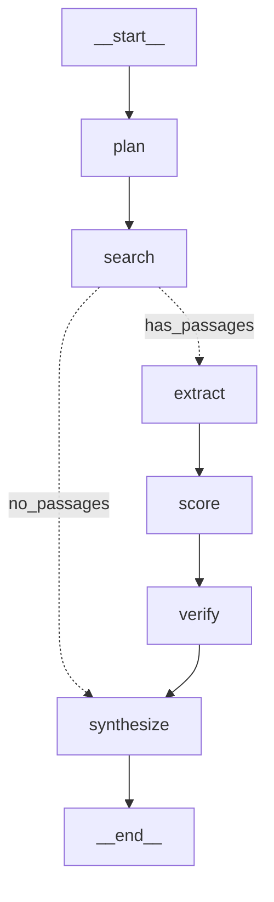

# Evidence Research Agent — Project Guide

A complete, junior-friendly guide to what this project is, how to run it, how
every part works, and how to follow a request through the system.

---

## 1. What this project is (in plain language)

You give it a research question ("Compare Qwen, Llama and Mistral for customer
support"). It:

1. Breaks the question into smaller sub-questions.
2. Searches the web, papers, arXiv, GitHub, Reddit, etc.
3. Reads the results and pulls out **claims** and the exact **source passage**
   that backs each claim.
4. Builds an **evidence graph** connecting claims → sources, and claims that
   **contradict** each other.
5. Scores how confident it is in each claim using *measurable* signals.
6. Writes a **report where every important sentence has a citation.**

### The one idea that matters

> **Generated text is never treated as evidence.** Every important claim in the
> final report can be traced back to a real passage from a real source.

Most "AI research" tools do *search → summarize → let the LLM write*. If the LLM
makes something up, you can't tell. This project instead does *search → extract
structured evidence → build a graph → verify → cite*. The differentiator is
**research as evidence-graph construction.**

---

## 2. Architecture at a glance

The pipeline is a **LangGraph state machine**. Each box is a node that reads and
updates a shared `ResearchState`:



- **plan** — LLM splits the question into sub-questions.
- **search** — connectors fetch sources; pages are cleaned, chunked into
  passages, and embedded.
- **extract** — for each sub-question, retrieve the best passages and have the
  LLM pull out claims + the verbatim supporting snippet.
- **score** — compute confidence from measurable signals.
- **verify** — merge duplicate claims, detect contradictions, and label each
  claim VERIFIED / PARTIALLY_SUPPORTED / CONFLICTING / UNSUPPORTED.
- **synthesize** — assemble the citation-backed report.

If no passages are found, a **conditional edge** skips straight to synthesize.

---

## 3. How everything is wired

The system runs on real backends end to end — there is no in-memory production
path. In-memory implementations exist **only** as test doubles (injected in the
test suite) so tests can run without Docker.

| Piece | Backend | Where |
|-------|---------|-------|
| LangGraph pipeline | Real `StateGraph` | `src/workflows/research.py` |
| LLM (OpenAI/Anthropic/Vertex/self-hosted) | LangChain `init_chat_model` | `src/llm/` |
| Embeddings (OpenAI/Voyage) | LangChain embeddings | `src/embeddings/` |
| Connectors (web/papers/arXiv/GitHub/Reddit) | Real HTTP when keys set | `src/sources/` |
| Keyword retrieval (BM25-style) | **Postgres full-text search** (`ts_rank`) | `src/retrieval/index.py` |
| Vector retrieval | **Qdrant** | `src/retrieval/index.py`, `src/stores/vector.py` |
| Hybrid fusion (RRF) | pure logic over both arms | `src/retrieval/pipeline.py` |
| Evidence graph | **Neo4j** (written at synthesis, read by `/graph`) | `src/stores/graph.py` |
| Jobs + evidence tables | **Postgres** (SQLAlchemy + Alembic) | `src/models/db.py`, `src/db/` |
| Job execution | **Redis + Celery** worker | `apps/worker/celery_app.py` |
| Graph checkpoint/resume | **LangGraph Postgres checkpointer** | `apps/worker/celery_app.py` |
| Security (SSRF, robots, PII, limits) | applied during fetching | `src/security/` |
| Evaluation metrics + gate | over datasets | `src/evaluation/` |
| React UI + Evidence Explorer | talks to the API | `apps/web/` |
| FastAPI HTTP API (auth'd) | persists + enqueues | `apps/api/` |

**What this means to run it:** the API and worker require the databases. Bring up
the Docker stack (Postgres, Neo4j, Qdrant, Redis) before running the API and
worker — see §6. The test suite still needs none of this: it injects in-memory
doubles for the repository, passage index, and graph store.

### The store seams (why tests need no database)

Three protocols let the same code run on real backends in production and
in-memory doubles in tests:

| Protocol | Production | Test double |
|----------|-----------|-------------|
| `JobRepository` (`src/db/repository.py`) | `PostgresJobRepository` | `InMemoryJobRepository` |
| `PassageIndex` (`src/retrieval/index.py`) | `PostgresQdrantPassageIndex` | `InMemoryPassageIndex` |
| `GraphStore` (`src/stores/graph.py`) | `Neo4jGraphStore` | `InMemoryGraphStore` |

`src/workflows/deps.py` builds the production `Deps`; tests build `Deps` with the
doubles (see `tests/conftest.py: make_deps`).

---

## 4. Prerequisites

- **Python 3.12** (the project targets 3.12).
- **[uv](https://docs.astral.sh/uv/)** for Python env/deps (`pip install uv` or
  the install script).
- **Node 18+** and npm (only for the web UI).
- **Docker** — required to run the app (Postgres, Neo4j, Qdrant, Redis). Not
  needed to run the automated test suite.

---

## 5. API keys you need

Keys are read from a `.env` file in the project root (see `.env.example`). Copy
it: `cp .env.example .env` and fill in what you need.

| Env var | What it's for | Required? | Where to get it |
|---------|---------------|-----------|-----------------|
| `API_KEYS` | Bearer token(s) the HTTP API accepts (comma-separated). The API **fails closed** with none set. | **Yes** to use the API | You make it up, e.g. `dev-key-123`. |
| `LLM_PROVIDER` | Which LLM backend: `openai` \| `anthropic` \| `vertex` \| `oai_compat`. | **Yes** | — |
| `LLM_MODEL` | Model id for that provider (e.g. `claude-sonnet-5`, `gpt-4o`). | **Yes** | — |
| `ANTHROPIC_API_KEY` | LLM calls when `LLM_PROVIDER=anthropic`. | If using Anthropic | console.anthropic.com |
| `OPENAI_API_KEY` | LLM calls when `LLM_PROVIDER=openai`, **and embeddings** when `EMBED_PROVIDER=openai` (the default). | Usually **yes** (embeddings) | platform.openai.com |
| `EMBED_PROVIDER` | `openai` (default) or `voyage`. | No (defaults) | — |
| `EMBED_MODEL` / `EMBED_DIM` | Embedding model + dimension (default `text-embedding-3-small` / `1536`). | No | — |
| `VOYAGE_API_KEY` | Embeddings when `EMBED_PROVIDER=voyage`. | If using Voyage | voyageai.com |
| `TAVILY_API_KEY` | Web search connector. Without it, web/documentation sources are skipped. | Recommended | tavily.com (free tier) |
| `GITHUB_TOKEN` | Higher GitHub API rate limits (search works unauthenticated too). | Optional | github.com tokens |
| `REDDIT_CLIENT_ID` / `REDDIT_CLIENT_SECRET` | Reddit connector. Skipped if unset. | Optional | reddit.com/prefs/apps |
| `LANGFUSE_PUBLIC_KEY` / `LANGFUSE_SECRET_KEY` / `LANGFUSE_HOST` | LLM tracing dashboard (managed cloud). | Optional | cloud.langfuse.com |

**Minimum to run a real end-to-end job:** `API_KEYS`, `LLM_PROVIDER` + its key,
`OPENAI_API_KEY` (for embeddings), `TAVILY_API_KEY` (for web sources), plus the
Docker databases below.

arXiv and Semantic Scholar (papers) need **no key**.

> Note: Vertex uses Google Cloud application-default credentials plus
> `GOOGLE_CLOUD_PROJECT`, and requires the optional `vertex` extra installed.

---

## 6. Setup — run the system

The API and worker use Postgres, Neo4j, Qdrant, and Redis, so bring those up
first. (Only the automated tests can run without them — see §10.)

```bash
# 1. Create the virtualenv and install the project.
uv venv
uv pip install -e ".[dev]"

# 2. Configure keys.
cp .env.example .env
#   edit .env: set API_KEYS, LLM_PROVIDER + key, OPENAI_API_KEY, TAVILY_API_KEY

# 3. Start the databases.
docker compose up -d          # postgres, neo4j, qdrant, redis
#   Neo4j browser: http://localhost:7474 (neo4j / researchpass)
#   Qdrant:        http://localhost:6333
#   Langfuse tracing is a managed cloud service (cloud.langfuse.com) — set the
#   LANGFUSE_* keys in .env if you want it; nothing runs locally.

# 4. Create the Postgres schema.
uv run alembic upgrade head

# 5. Start the Celery worker (runs the pipeline).
uv run celery -A apps.worker.celery_app worker --loglevel=info

# 6. In another terminal, start the API.
uv run uvicorn apps.api.main:app --reload
#   → http://localhost:8000  (interactive docs at /docs)
```

The `.env` service URLs (`POSTGRES_DSN`, `NEO4J_URI`, `QDRANT_URL`, `REDIS_URL`)
already point at the docker-compose services.

### Start a research job

```bash
# Replace dev-key-123 with a value from your API_KEYS.
curl -X POST http://localhost:8000/api/research \
  -H "Authorization: Bearer dev-key-123" \
  -H "Content-Type: application/json" \
  -d '{"question":"What context length does Model X support?","depth":"fast"}'
# → {"research_id":"res_abc123","status":"queued"}
```

The API persists the job to Postgres and enqueues it on Celery; the worker runs
the pipeline. Poll and read results (all endpoints need the same header):

```bash
curl -H "Authorization: Bearer dev-key-123" http://localhost:8000/api/research/res_abc123
curl -H "Authorization: Bearer dev-key-123" http://localhost:8000/api/research/res_abc123/report
curl -H "Authorization: Bearer dev-key-123" http://localhost:8000/api/research/res_abc123/graph
```

### Run the web UI

```bash
cd apps/web
npm install
# Tell the UI which API key to send (must match one in API_KEYS):
echo "VITE_API_KEY=dev-key-123" > .env.local
npm run dev
#   → http://localhost:5173  (proxies /api to localhost:8000)
```

The UI: enter a question → watch progress → explore the **Evidence Explorer**
(click a claim to see its confidence, supporting sources, contradictions, and
related claims).

---

## 7. How a request flows — follow the execution

Trace one job through the code. Entry point: `POST /api/research`
(`apps/api/main.py`).

1. **`apps/api/main.py: create_research`** — checks your Bearer key
   (`apps/api/auth.py`), calls `repository.create(request)` which **persists a
   queued job to Postgres**, then enqueues the id on Celery. Returns
   `research_id` immediately.

2. **`apps/worker/celery_app.py: run_research_task`** — loads the job from
   Postgres (`repository.get`), opens a **LangGraph Postgres checkpointer**,
   builds live dependencies (`build_deps` → LLM, embedder, connectors, the
   Postgres+Qdrant passage index, the Neo4j graph store), runs the pipeline, and
   **saves the final state back to Postgres** (`repository.save`).

3. **`src/workflows/research.py: run_pipeline`** — builds the LangGraph
   `StateGraph`, compiles it with the checkpointer, and invokes it. Each node:

   - **plan** (`agents/planner.py`) → sub-questions. Anti-over-decomposition:
     it's told to prefer differentiating questions, not "What is X?" for each.
   - **search** (`agents/researcher.py` + `sources/*`) → each connector searches;
     pages are fetched and cleaned (`sources/fetcher.py`, with SSRF/robots/PII
     guards), chunked, embedded, and **written to the passage index** (Postgres
     rows for FTS + Qdrant vectors). Dedup is by content hash.
   - **extract** (`agents/extractor.py`) → retrieve top passages per
     sub-question via the index (**Postgres FTS keyword + Qdrant vector**, fused
     with RRF in `retrieval/pipeline.py`), then the LLM returns
     `{claim, passage_id, evidence_snippet, entities}`. Claims citing a passage
     that wasn't shown are dropped (anti-hallucination).
   - **score** (`evidence/scoring.py`) → fill each claim's confidence from
     measurable signals (see §9).
   - **verify** (`agents/verifier.py`) → resolve duplicate claims
     (`evidence/resolution.py`), detect contradictions
     (`evidence/contradiction.py`), and label each claim
     (`evidence/verification.py`).
   - **synthesize** (`agents/synthesizer.py` + `evidence/citations.py`) →
     assemble the report with per-claim citations, and **persist the evidence
     graph to Neo4j** (`evidence/graph.py: persist_graph`).

4. The GET endpoints read job state from Postgres (`repository.get`) and the
   `/graph` endpoint reads the evidence graph from Neo4j (`graph_store.subgraph`).

---

## 8. Directory / module guide

```
src/
├── config.py            Settings + depth caps (fast/normal/deep). Single source of config.
├── clock.py             UTC time helpers (no deprecated utcnow()).
├── models/schemas.py    ALL the domain types (ResearchState, Claim, Source, Evidence, …).
│
├── llm/                 LLM abstraction
│   ├── base.py            LLMProvider protocol + message/result/role types.
│   ├── langchain_provider.py  Wraps a LangChain chat model as an LLMProvider.
│   ├── factory.py         init_chat_model → provider (openai/anthropic/vertex/self-hosted).
│   └── structured.py      Ask-for-JSON + validate against a Pydantic schema (with retries).
│
├── embeddings/          Embedding abstraction (LangChain OpenAI/Voyage behind an Embedder).
│
├── agents/              The 5 pipeline components
│   ├── planner.py         Question → sub-questions.
│   ├── researcher.py      Runs connectors, fetches, chunks, stores passages.
│   ├── extractor.py       Passages → structured claims + evidence.
│   ├── verifier.py        Orchestrates resolution → contradiction → verification.
│   └── synthesizer.py     Verified claims → citation-backed report.
│
├── retrieval/           keyword + semantic + hybrid (RRF) + reranker stub.
│   ├── index.py          PassageIndex: Postgres FTS keyword + Qdrant vector (+ in-memory double).
│   └── pipeline.py        retrieve_top_passages: run both arms, fuse with RRF.
│
├── db/                  Postgres persistence
│   ├── base.py           Engine, session factory, declarative Base.
│   ├── repository.py     JobRepository: PostgresJobRepository (+ InMemory double).
│   ├── mappers.py        State ↔ ORM-row conversion.
│   └── migrations/       Alembic env + baseline migration.
│
├── models/
│   ├── schemas.py        ALL domain types (Pydantic).
│   └── db.py             SQLAlchemy ORM tables (jobs, sources, passages, claims, …).
│
├── evidence/            The evidence graph brain
│   ├── resolution.py      Merge paraphrased claims; flag same-subject/diff-value as conflicts.
│   ├── contradiction.py   Turn conflict candidates into contradictions; pick a winner by source quality.
│   ├── verification.py    LLM entailment + signals → claim status.
│   ├── confidence.py      The confidence formula (measurable factors only).
│   ├── scoring.py         Fill confidence + merge entities into state.
│   ├── citations.py       Per-claim citation index + Sources section.
│   └── graph.py           Project state into {nodes, edges}; persist to the graph store.
│
├── sources/             Connectors behind one interface
│   ├── base.py            SourceConnector protocol + RawResult.
│   ├── web.py/papers.py/arxiv.py/github.py/reddit.py/youtube.py/api.py
│   ├── registry.py        Build the right connectors for a request (skips ones missing keys).
│   ├── fetcher.py         Safe fetch + clean + chunk (LangChain text splitter).
│   └── quality.py         Source quality score (authority + recency + relevance + primary + corroboration).
│
├── stores/              Backend clients + in-memory doubles
│   ├── graph.py           GraphStore: Neo4jGraphStore (+ InMemoryGraphStore).
│   ├── vector.py          QdrantVectorStore.
│   └── cache.py           Redis cache.
├── reliability/         cost/pricing, retry+fallback, rate limiting.
├── security/            url_guard (SSRF), robots, limits, pii, sanitize, injection.
├── observability/       OpenTelemetry stage tracing.
├── evaluation/          dataset schema, metrics/, runner, gate, CLI.
└── workflows/
    ├── research.py        THE LangGraph StateGraph + run_pipeline.
    └── deps.py            Build live deps (real stores) from settings.

apps/
├── api/    FastAPI app (main.py), auth (auth.py), DI providers (dependencies.py).
├── worker/ Celery worker: loads job, runs pipeline w/ Postgres checkpointer, saves.
└── web/    React + TypeScript UI (Evidence Explorer).
```

---

## 9. Key concepts, explained

### Confidence is measured, not guessed

An LLM asked "how confident are you?" just makes up a number. Instead
(`evidence/confidence.py`):

```
confidence = source_quality × evidence_strength × source_agreement × extraction_confidence
```

- **source_quality** — from `sources/quality.py`: authority (docs > paper >
  blog > reddit) + recency + relevance + primary-source bonus + corroboration,
  normalized 0–1.
- **evidence_strength** — cosine similarity between the claim text and the
  supporting passage embedding.
- **source_agreement** — `min(distinct corroborating sources / 3, 1)`.
- **extraction_confidence** — a calibrated extraction signal (currently a
  documented constant; the design slot is self-consistency across repeated
  extractions).

### Resolution before contradiction (why it matters)

"128K context" and "supports up to 128,000 tokens" are the *same* fact.
`resolution.py` embeds claims, finds near-duplicates, and asks the LLM: same,
contradiction, or different? Same → **merge** (so corroboration counts once).
Contradiction (same subject, different value) → keep separate and flag. Without
this step, contradiction detection would fire on paraphrases and miss real
conflicts.

### Contradictions are surfaced, never silently resolved

`contradiction.py` picks a "winner" by measurable source quality (a newer
official doc beats an old blog) but **both** claims appear in the report's
Conflicting Evidence section with the rationale.

### Citations attach to claims, not paragraphs

`citations.py` assigns each cited source a number and renders `[1]`, `[2]`
markers on the individual claim lines, plus a Sources list.

### Retrieval is hybrid

`retrieval/hybrid.py` fuses a keyword ranking and a semantic ranking with
**Reciprocal Rank Fusion** (no reranker in v1 — the interface is stubbed).

### Security treats web content as hostile

`sources/fetcher.py` re-checks SSRF safety on *every redirect hop*, honors
robots.txt, caps page size, and redacts PII. Retrieved text is wrapped as
delimited *untrusted data* (`security/injection.py`) so it can't act as
instructions to the LLM.

---

## 10. How to test

```bash
# Python: unit + integration + evaluation (uses fakes — no API keys needed).
uv run pytest                    # ~40 tests
uv run pytest tests/unit -q      # just units
uv run pytest -k contradiction   # a specific area

# Lint.
uv run ruff check src apps tests

# Web.
cd apps/web && npm run typecheck && npm run test && npm run build
```

**How the tests avoid needing API keys:** `tests/conftest.py` provides a
`FakeLLM`, `FakeEmbedder`, and `FakeConnector`. The whole pipeline is dependency
-injected (`Deps`), so tests run the real LangGraph graph with fake models. What
each test group covers:

- `tests/unit/` — retrieval fusion, confidence math, resolution/contradiction,
  reliability (cost/retry/rate-limit), security (SSRF/PII/limits), LangChain
  adapters.
- `tests/integration/` — full pipeline smoke test, the API lifecycle (incl.
  auth 401s), a 128K-vs-32K contradiction end to end, and LangGraph
  interrupt/resume.
- `tests/evaluation/` — metric units and a dataset run through the regression
  gate.

---

## 11. How to follow / debug execution

- **Job status endpoint** — `GET /api/research/{id}` returns the current status,
  counts (sources/passages/claims/contradictions), and running **cost** (tokens
  + USD estimate). This is the first place to look.

- **See the graph shape** — print the LangGraph structure (deps are only bound,
  not called, so `None` placeholders are fine here):
  ```bash
  uv run python -c "from src.workflows.research import build_state_graph, Deps; \
    print(build_state_graph(Deps(None,None,{},None,None)).compile().get_graph().draw_mermaid())"
  ```

- **Trace a single claim** — `GET /api/research/{id}/graph` returns
  `{nodes, edges}`. Find your claim node, follow its `SUPPORTS` edges to sources
  and `CONTRADICTS` edges to conflicting claims. The Evidence Explorer UI does
  exactly this visually.

- **Tracing** — each node runs inside an OpenTelemetry span
  (`observability/tracing.py`). With an OTel exporter (or Langfuse keys)
  configured you get per-stage latency; without one it's a safe no-op.

- **Reproduce without the API/worker** — run the pipeline directly in a REPL
  (still needs the databases up, since `build_deps` wires Postgres/Qdrant/Neo4j):
  ```python
  from src.models.schemas import ResearchState
  from src.workflows.deps import build_deps
  from src.workflows.research import run_pipeline
  state = ResearchState(original_question="…")
  run_pipeline(state, build_deps(state.source_types))
  print(state.report)
  ```

- **Step through the graph** — `compile_graph(deps, interrupt_before=["verify"])`
  stops before a node so you can inspect the state, then resume with
  `graph.invoke(None, config)`.

---

## 12. Troubleshooting

- **401 from the API** — your `Authorization: Bearer …` value isn't in
  `API_KEYS`, or `API_KEYS` is empty (the API fails closed by design).
- **No web/paper sources returned** — missing `TAVILY_API_KEY`; the connector is
  silently skipped. arXiv/Semantic Scholar still work without keys.
- **Embeddings error** — `EMBED_PROVIDER=openai` (default) needs
  `OPENAI_API_KEY` even if your LLM is Anthropic. Or switch to Voyage.
- **`report` is empty but status is completed** — usually zero passages were
  found (bad/blocked sources); the conditional edge skipped extraction. Check
  the source count in the status endpoint.
- **Import errors on startup** — run inside the uv venv
  (`uv run …`) so all deps resolve.
- **`connection refused` / DB errors** — a database isn't up. Run
  `docker compose up -d` and `uv run alembic upgrade head`.
- **Job stays `queued`** — no Celery worker is running, or it can't reach Redis.
  Start `uv run celery -A apps.worker.celery_app worker`.
- **Worker crashes with `SIGABRT` / `objc[...] fork() ... Crashing instead`** —
  a macOS fork-safety abort in Celery's prefork pool. The worker already defaults
  to a thread pool on macOS to avoid this; if you overrode `--pool`, drop it or
  use `--pool=threads`.
- **Neo4j `constraint already exists` notifications** — harmless `INFORMATION`
  messages from `CREATE CONSTRAINT IF NOT EXISTS`, not errors.

---

## 13. Where to go next (known gaps)

- Add a real reranker (the interface is ready and stubbed as identity).
- Expand the evaluation dataset with real labeled cases and run the gate live.
- Add caching (Redis) on fetches/embeddings and per-provider rate limiting into
  the hot path (helpers exist in `src/reliability/`).
- Job history / follow-up questions that reuse an existing evidence graph.
