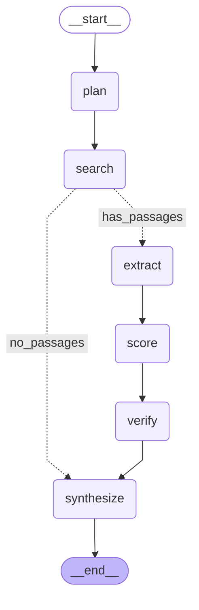

# Research pipeline graph

Auto-generated by `scripts/generate_graph_diagram.py`. The pipeline is a LangGraph
`StateGraph` over `ResearchState`: plan → search → (extract → score → verify) →
synthesize, with a conditional edge after search that skips straight to synthesis
when no passages were found.

